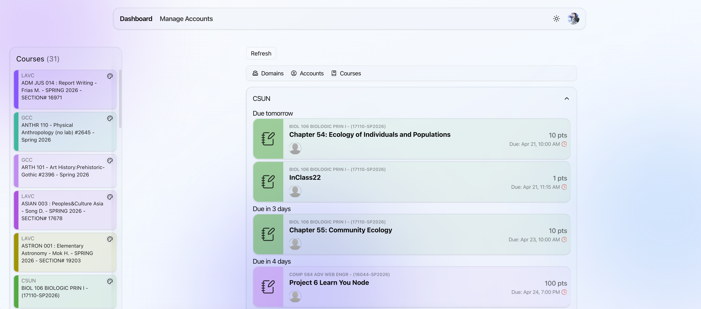
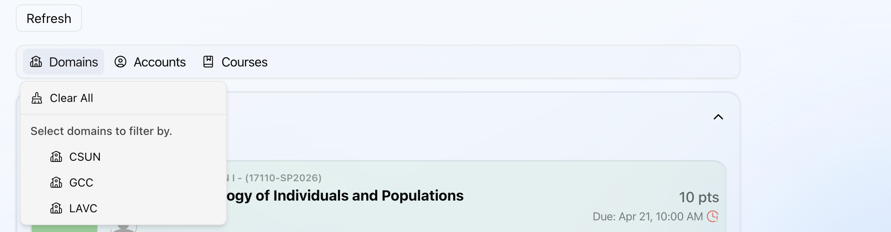

# Canvas Merge

Canvas Merge is a Next.js app that helps users connect one or more Canvas accounts and view merged course and planner data from a single dashboard.

Live site: [canvas-merge.vercel.app](https://canvas-merge.vercel.app/auth/sign-in)

## Screenshots

### Dashboard



### Filters



## Features

- Neon Auth sign-in flow for protected pages
- Multi-account Canvas connection flow
- Encrypted storage for Canvas personal access tokens
- Unified dashboard for courses and planner data
- Prisma-backed Postgres data layer

## Tech Stack

- Next.js 16 App Router
- React 19
- TypeScript
- Prisma
- Neon Auth
- Tailwind CSS 4

## Environment Variables

Create a `.env` file with the values your environment needs:

```bash
DATABASE_URL=
DIRECT_URL=
NEON_AUTH_BASE_URL=
NEON_AUTH_COOKIE_SECRET=
CANVAS_TOKEN_KEY=
```

Notes:

- `DATABASE_URL` is used by the Prisma client at runtime.
- `DIRECT_URL` is used by Prisma config and migrations.
- `CANVAS_TOKEN_KEY` must be a base64-encoded 32-byte key.

## Getting Started

Install dependencies:

```bash
npm install
```

Run your database migrations:

```bash
npx prisma migrate dev
```

Start the development server:

```bash
npm run dev
```

Then open [http://localhost:3000](http://localhost:3000).

## App Flow

1. Visit the app and sign in.
2. The root route redirects to `/dashboard`.
3. If no Canvas accounts are connected yet, the dashboard guides the user through connecting one.
4. Once connected, the dashboard loads merged courses and planner data.

## Scripts

```bash
npm run dev
npm run build
npm run start
npm run lint
```
